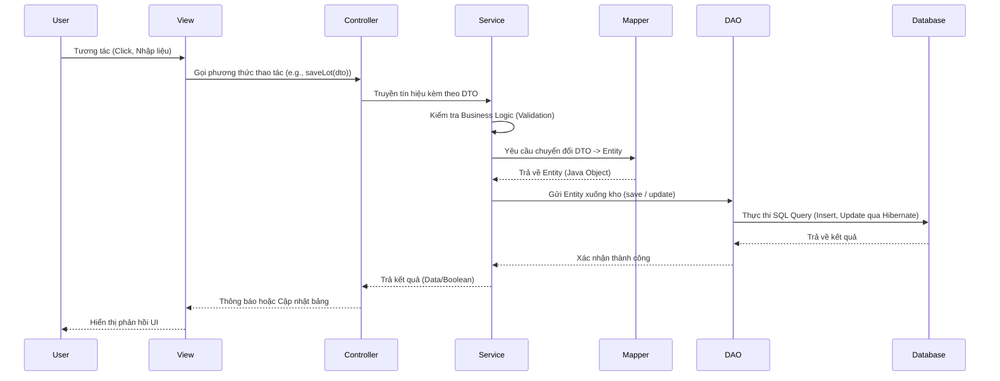

# TÀI LIỆU QUÁ TRÌNH HIỆN THỰC VÀ TRIỂN KHAI DỰ ÁN AGRICHAIN
*(Phiên bản Chi tiết và Chuyên sâu)*

---

## 1. TỔNG QUAN KIẾN TRÚC HỆ THỐNG VÀ MÔ HÌNH MVC

Dự án **AgriChain** được xây dựng nhằm giải quyết bài toán Quản lý chất lượng, Nguồn gốc và Chi phí trong Chuỗi cung ứng Nông nghiệp. Hệ thống yêu cầu khả năng mở rộng tốt, khả năng bảo trì cao và luồng dữ liệu minh bạch. Vì vậy, thay vì sử dụng cách tổ chức mã nguồn nguyên khối (Monolithic Code), chúng tôi đã áp dụng triệt để mô hình **Thiết kế Phân lớp (N-Tier Layered Architecture)** và **MVC (Model-View-Controller)**.

Sự tách biệt rõ ràng này đảm bảo:
- **Separation of Concerns (Tách biệt mối quan tâm):** Giao diện (View) không can thiệp vào cách dữ liệu được truy vấn (DAO), và Database không bị rò rỉ cấu trúc ra bên ngoài cho giao diện.
- **Tính trắc nghiệm (Testability):** Dễ dàng viết test nội bộ cho từng Service hoặc DAO.
- **Tính độc lập của giao diện:** Có thể dễ dàng thay đổi thư viện UI (Swing sang JavaFX) mà không cần viết lại toàn bộ mã xử lý Business Logic.

### 1.1. Luồng dữ liệu (Data Flow)

Toàn bộ thông tin đi qua hệ thống tuân thủ theo trình tự nghiêm ngặt (Strict Layering):



### 1.2. Phân tách vòng đời các Layer
1. **Model (Entities & DAOs):** Đại diện cho dữ liệu cốt lõi, chịu trách nhiệm lưu trữ và truy vấn thông tin trong Database. Mọi giao dịch với cơ sở dữ liệu phải thực hiện trong tầng này bằng mã HQL/JPQL.
2. **Controller (Controllers & Services):** Đóng vai trò là "bộ não" điều phối. Nó định tuyến dữ liệu, áp đặt các quy tắc quản trị, quy tắc kiểm chứng (VD: Không được nhập số lượng quá số tồn kho) trước khi cho phép dữ liệu xuống tới DAO.
3. **View (Swing Panels, Frames):** Chuyên trách trình diễn. Chú trọng vào bố cục, định dạng màu sắc (FlatLaf), bắt sự kiện người dùng và cập nhật giao diện bất đồng bộ mà không gây đóng băng máy tính.

---

## 2. QUẢN LÝ DỰ ÁN VỚI MAVEN VÀ CÁC DEPENDENCIES CỐT LÕI

Dự án sử dụng **Apache Maven** để quản lý chu trình biên dịch (build lifecycle) và cấu trúc thư viện phụ thuộc (dependencies). Mã nguồn được chia gói theo cấu trúc `/src/main/java/` và `/src/test/java/`. Toàn bộ cấu hình được định nghĩa trong `pom.xml`.

### 2.1. Quản trị Dependency
Chúng tôi đã cẩn thận chọn lọc những công nghệ Enterprise tốt nhất trong hệ sinh thái Java:
- **Hibernate Core & Jakarta Persistence (JPA):** Là Framework ORM chuẩn công nghiệp. Thay vì viết JDBC `PreparedStatement` khô khan, JPA cho phép làm việc với cơ sở dữ liệu quan hệ hoàn toàn thông qua Lập trình Hướng đối tượng.
- **MapStruct:** Là Annotation Processor thông minh nhất. Nó tự sinh mã code Java thực thụ ở quá trình Compile, giúp map các fields có sự tương quan giữa các Class, hiệu năng cực cao vì không dùng Java Reflection thời gian thực.
- **Lombok:** Xóa bỏ sự phức tạp của việc khai báo getter, setter, logs, build patterns. Các Entity chỉ cần bộ tứ Annotation `@Data`, `@NoArgsConstructor`, `@AllArgsConstructor`, `@Builder` là đủ.
- **FlatLaf:** Một bộ giao diện bổ sung vào Java Swing. Khắc phục nhược điểm thẩm mỹ nguyên thủy của Swing, FlatLaf giả lập hoàn hảo các thành phần đồ họa của hệ điều hành hiện đại (Mac/Windows 11).
- **JFreeChart:** Thư viện đứng đầu về vẽ biểu đồ khoa học: Thống kê sinh khối, năng suất, mưa rải phân bố theo tháng trong AgriChain.

### 2.2. Đóng Gói Ứng Dụng (Shade Plugin)
Để thuận tiện trong việc phát triển và phân phối, ta cần đóng gói (pack) toàn bộ mã nguồn cùng các thư viện Maven thành một file `.jar` duy nhất (Tiếng anh gọi là Fat-JAR hay Uber-JAR). 

Chúng tôi sử dụng `maven-shade-plugin` có khả năng gộp toàn bộ class của các dependencies vào. Đặc biệt với các thư viện quy mô như Hibernate, phải cấu hình `ServicesResourceTransformer` để nó trộn đúng các cấu hình Service Provider (như cấu hình JDBC Driver) không bị đè lên nhau.

---

## 3. HIỆN THỰC TẦNG DATA MODEL (JPA / HIBERNATE)

### 3.1. Chuyển Dịch từ Relational Database Schema sang ORM Graph
Với một Schema gồm hơn mười bảng (Customer, Employee, SystemRole, Farm, ProduceLot, Supply, HarvestRecord,...), việc duy trì và liên kết chúng trong Memory là trọng tâm của dự án. 

JPA thực hiện ánh xạ (mapping) thông qua Metadata Annotations trên các lớp Java. Thuật ngữ "Entity" được xem như "Một dòng dữ liệu trong DB ở trạng thái đang sống trong RAM". Lớp `BaseEntity` được tạo ra để kế thừa các thành phần dùng chung nếu cần, nhưng hầu hết chúng ta triển khai `@Id` chi tiết.

### 3.2. Hiện thực mẫu Entity `ProductionLot`
Lô sản xuất (Production Lot) là trung tâm của mọi hoạt động. Nó ánh xạ các thông tin quy định, trang trại cấy, con giống sử dụng.

```java
@Entity
@Table(name = "Production_Lot") // Mapping trực tiếp vào bảng DB
@Data 
@NoArgsConstructor
@AllArgsConstructor
public class ProductionLot {

    @Id
    @GeneratedValue(strategy = GenerationType.IDENTITY)
    private Long id;

    @Column(name = "lot_code", unique = true, nullable = false, length = 50)
    private String lotCode; // Mã lô duy nhất (Vd: LOT-001)

    // Liên kết Many-To-One: Nhiều Lô Sản Xuất thuộc về Một Trang Trại
    @ManyToOne(fetch = FetchType.LAZY) 
    @JoinColumn(name = "farm_id", referencedColumnName = "id")
    private Farm farm;

    // Liên kết Many-To-One tới người phụ trách
    @ManyToOne(fetch = FetchType.LAZY)
    @JoinColumn(name = "manager_id")
    private Employee manager;

    @Column(name = "planted_date")
    private java.util.Date plantedDate; // Ngày gieo hạt/trồng

    @Column(name = "expected_harvest_date")
    private java.util.Date expectedHarvestDate; // Kỳ vọng thu hoạch
}
```

### 3.3. Chiến lược Fetching: Định tuyến dữ liệu linh hoạt (Lazy vs Eager)
Lỗi hiệu năng N+1 khét tiếng trong ORM.
- **FetchType.EAGER:** Khi lấy `Employee`, Hibernate tự động JOIN thêm bảng `SystemRole` để lấy `roleCode`. Vì bảng vai trò (Role) Rất nhỏ, ta dùng EAGER để luôn có đầy đủ role mà không tốn thêm câu Query thứ 2.
- **FetchType.LAZY:** Khi lấy `ProductionLot`, Hibernate tạo ra một Proxy (vật thay thế ảo) cho đối tượng `Farm`. Hệ thống KHÔNG tự động lấy toàn bộ thông tin Trang trại. Chỉ khi nào gọi lệnh `lot.getFarm().getFarmName()` thì Hibernate mới lẳng lặng Execute cú `SELECT` thứ hai trong cơ sở dữ liệu. 
Việc này cứu toàn ứng dụng khỏi tình trạng quá tải Memory.

---

## 4. TẦNG DATA ACCESS OBJECT (DAO) & QUẢN LÝ TRANSACTION

Để cách ly việc sử dụng JPA (EntityManager) khỏi logic hệ thống nghiệp vụ, chúng ta gói dọn toàn bộ các câu lệnh vào kiến trúc `DAO`.

### 4.1. Sự kế thừa BaseDAO
Nhờ Generics (`<T>`) trong Java, chúng tôi tối giản sự lặp lại.

```java
public abstract class BaseDAO<T> {
    private final Class<T> entityClass;
    
    // Yêu cầu class con phải khai báo Type (Ví dụ: Employee.class)
    public BaseDAO(Class<T> entityClass) {
        this.entityClass = entityClass;
    }

    // HibernateSessionFactory là lớp singleton đã config XML
    protected EntityManager getEntityManager() {
        return HibernateUtil.getSessionFactory().createEntityManager();
    }

    // Một hàm Save dùng cho 10 bảng khác nhau
    public T save(T entity) {
        EntityManager em = getEntityManager();
        try {
            em.getTransaction().begin(); // Mở vòng an toàn
            em.persist(entity);          // Cắm cờ insert
            em.getTransaction().commit(); // Xác thực
            return entity;
        } catch (Exception e) {
            em.getTransaction().rollback(); // Trả về trạng thái ban đầu nếu nổ lỗi
            throw e;
        } finally {
            em.close(); // Giải phóng resource
        }
    }
}
```

### 4.2. Tùy Biến JPQL Trong Các Bảng Nghiệp Vụ Chéo
Các DAO cụ thể kế thừa `BaseDAO`, tận dụng các hàm chuẩn hóa, đồng thời có thể độc lập viết truy vấn phức tạp bằng JPQL (Java Persistence Query Language - Tương tác Model thay vì tác động Schema).

Ví dụ: Phương thức lọc ra năng suất các nhân viên nông trường (Vai trò: WORKER)

```java
public class EmployeeDAO extends BaseDAO<Employee> {
    public EmployeeDAO() {
        super(Employee.class);
    }

    // Phương thức phân tích để vẽ Top Doanh thu/Sản lượng
    public List<Object[]> getHarvestPerformance() {
        EntityManager em = getEntityManager();
        try {
            return em.createQuery(
                "SELECT e.fullName, SUM(h.yieldKg) " +
                "FROM HarvestRecord h " +
                "JOIN h.employee e " + // JPQL Join qua Annotation Relational link
                "WHERE e.role.code = 'WORKER' " +
                "GROUP BY e.id, e.fullName " +
                "ORDER BY SUM(h.yieldKg) DESC", Object[].class)
                .setMaxResults(10) // Lọc Limit Top 10 trong Engine Database
                .getResultList();
        } finally {
            em.close();
        }
    }
}
```

---

## 5. DỮ LIỆU ĐÓNG GÓI CHUYỂN GIAO (DTO) VÀ AUTO-MAPPING

Nguyên tắc bất di bất dịch của mô hình Multi-Tiering an toàn là: **Không để một thực thể Entity nào lạc sang tầng View.** 
Vì sao?
1. Thực thể có Data Binding của Hibernate (những đối tượng Proxy LAZY), nếu View cố đọc chúng sau khi Tầng DAO đã đóng kết nối (session closed), Java sẽ ném văng lỗi `LazyInitializationException`. Lỗi này cực kỳ khó nhằn.
2. Form chỉnh sửa chỉ gửi lên `ID` của Trang trại (Ví dụ: Số `15`), chứ nó không có cả cấu trúc Object Farm để nhúng vào Entity cũ. Do đó cần 1 đối tượng linh hoạt nhận JSON/Values từ Client trước. Nó chính là **Data Transfer Object (DTO)**.

### 5.1. Kiến tạo DTO
DTO rất đơn giản. Ta chẻ nhỏ toàn bộ Object Relationship thành các field ID cụ thể:

```java
@Data
public class HarvestRecordDTO {
    private Long id;
    private Long lotId;          // Không mang toàn bộ Object ProductionLot
    private String lotCode;      // Thuộc tính tiện ích phục vụ việc đọc lên form (Readability)
    private java.util.Date harvestDate;
    private Double yieldKg;
    private String qualityGradeCode;
    // Tự động map ID và Tên cho hiển thị dropdown List
    private Long employeeId;     
    private String employeeName; 
}
```

### 5.2. MapStruct Processor Thao tác
Gạt bỏ công việc tẻ nhạt phải tự code Mapper thủ công, chúng tôi tận dụng `MapStruct`. Nó tự quét hệ thống, nhận diện các cặp Entity-DTO bằng Annotation, phân tích cú pháp chuỗi và tự "code giùm" ra Class Builder trong nền.

```java
@Mapper(componentModel = "default")
public interface HarvestRecordMapper {
    HarvestRecordMapper INSTANCE = Mappers.getMapper(HarvestRecordMapper.class);

    // Báo cho MapStruct biết cần giải nén ID và Tên của Entity con và ghép vào DTO
    @Mapping(source = "productionLot.id", target = "lotId")
    @Mapping(source = "productionLot.lotCode", target = "lotCode")
    @Mapping(source = "employee.id", target = "employeeId")
    @Mapping(source = "employee.fullName", target = "employeeName")
    @Mapping(source = "customer.id", target = "customerId")
    @Mapping(source = "customer.name", target = "customerName")
    HarvestRecordDTO toDto(HarvestRecord entity);

    // Chuyển ngược lại
    @Mapping(source = "lotId", target = "productionLot.id")
    @Mapping(source = "employeeId", target = "employee.id")
    @Mapping(source = "customerId", target = "customer.id")
    HarvestRecord toEntity(HarvestRecordDTO dto);

    List<HarvestRecordDTO> toDtoList(List<HarvestRecord> entities);
}
```

---

## 6. LỚP NGHIỆP VỤ CAO CẤP (SERVICE LAYER) & CONTROLLER

### 6.1. Logic Doanh Nghiệp (Service)
Service là hạt nhân tri thức của dự án. Lớp này tiếp nhiên liệu và xác minh (Validation). Bất kì thao tác bất hợp lệ nào cũng bị đẩy văng lại hệ thống thông qua `RuntimeException` nhằm hủy Request càng sớm càng tốt.

```java
public class HarvestRecordService {
    private final HarvestRecordDAO harvestDao = new HarvestRecordDAO();
    private final HarvestRecordMapper mapper = HarvestRecordMapper.INSTANCE;

    public void createRecord(HarvestRecordDTO dto) {
        // Verification Rules
        if(dto.getYieldKg() != null && dto.getYieldKg() < 0) {
            throw new IllegalArgumentException("Năng suất thu hoạch phải là số lớn hơn không");
        }
        if(dto.getLotId() == null) {
            throw new IllegalArgumentException("Vui lòng ấn định Lô thu hoạch");
        }
        
        HarvestRecord entity = mapper.toEntity(dto);
        harvestDao.save(entity); // Commit to DAO
    }

    public List<HarvestRecordDTO> getRecordsByLotCode(String code) {
        List<HarvestRecord> rawData = harvestDao.findByLotCode(code);
        return mapper.toDtoList(rawData);
    }
}
```

### 6.2. Cầu nối Định tuyến (Controller)
Cung cấp cổng chuyển qua Interface `BaseController<T>` để mọi View Panel đều có cơ chế gọi CRUD trơn tru. Controller thường chỉ mang tính trung chuyển DTO từ UI về logic Service và xử lý ngoại lệ cho người dùng.

```java
public class HarvestRecordController extends BaseController<HarvestRecordDTO> {
    private final HarvestRecordService service = new HarvestRecordService();

    // Mapping các hàm
    public void createHarvestRecord(HarvestRecordDTO dto) {
        service.createRecord(dto);
    }

    public List<HarvestRecordDTO> findByLotCode(String keyword) {
        return service.getRecordsByLotCode(keyword);
    }
}
```

---

## 7. KIẾN TRÚC GIAO DIỆN PHẲNG (SWING & FLATLAF VIEW)

Mặc định, Java Swing cũ của Sun Microsystems có kiến trúc Look & Feel (LAF) - Metal khá lỗi thời và góc cạnh. Chúng tôi áp dụng **FlatLaf** để can thiệp vào cách Engine Graphics vẽ nút bấm nhúng và Field.

### 7.1. Cấu trúc Layout Management Thông minh
Toàn bộ form thêm thông tin được quản trị bằng **GridBagLayout** (Cho Form Cập Nhật), và **BorderLayout** + **FlowLayout** (Cho Bố cục Main Dashboard).

Việc viết Form với FlatLaf đã được gom dọn thành ToolKit tái sử dụng là tiện ích `UiUtils.java`:

```java
public static void styleTable(JTable table) {
    table.setFont(AppTheme.FONT_BODY);
    table.setRowHeight(36); 
    table.setShowVerticalLines(false);
    table.setShowHorizontalLines(true);
    table.setGridColor(AppTheme.BORDER_LIGHT);
    table.setSelectionBackground(new Color(0xD8F3DC)); // Xanh nhạt Flat
    table.getTableHeader().setFont(AppTheme.FONT_SUBTITLE);
    
    // Tự động ngựa vằn Rows (Zebra Strips)
    table.setDefaultRenderer(Object.class, new DefaultTableCellRenderer() {
        @Override
        public Component getTableCellRendererComponent(JTable t, Object val, boolean isSel, boolean focus, int row, int col) {
            Component c = super.getTableCellRendererComponent(t, val, isSel, focus, row, col);
            if (!isSel) {
                c.setBackground(row % 2 == 0 ? AppTheme.BG_CARD : AppTheme.BG_TABLE_ROW_ALT);
            }
            return c;
        }
    });
}
```

Việc tích hợp Form với `GridBagLayout` chuẩn hóa 2 cột trái phải (Nhãn và Input):

```java
private void addGridRow(JDialog d, GridBagConstraints g, String label, JComponent field, int row) {
    g.gridy = row;
    
    // Cột 0: Label
    g.gridx = 0; g.weightx = 0.3; g.gridwidth = 1;
    JLabel lbl = new JLabel(label);
    lbl.setFont(AppTheme.FONT_BODY);
    d.add(lbl, g);
    
    // Cột 1: TextField/ComboBox
    g.gridx = 1; g.weightx = 0.7; g.gridwidth = 1;
    if(field instanceof JTextField) {
        field.setFont(AppTheme.FONT_BODY);
        // Trick từ FlatLaf: Tự bo tròn nút
        ((JTextField)field).putClientProperty("JComponent.roundRect", true); 
        field.setPreferredSize(new Dimension(field.getPreferredSize().width, 32));
    }
    d.add(field, g);
}
```

### 7.2. Giao Dịch Đa Luồng với SwingWorker (EDT Protection)
Luồng sự kiện (Event Dispatch Thread - EDT) của Giao diện HĐH là Đơn Luồng. Nếu ta ấn Nút Tìm Kiếm, sau đó Controller chạy gọi MySQL (độ trễ khoảng 0.2 đến 2 giây cho dữ liệu lớn), toàn độ hệ thống đồ họa sẽ "nằm chờ" gây trạng thái Not Responding.

Mô hình hiện thực dự án này tích hợp triệt để `SwingWorker<V, T>`:

```java
void refreshTable(String lotCode) {
    // 1. Làm sạch bảng và báo hiệu trên luồng EDT hiện tại
    tableModel.setRowCount(0);

    // 2. Tách ra 1 Background Thread khác không phong tỏa giao diện
    new SwingWorker<List<HarvestRecordDTO>, Void>() {
        
        @Override 
        protected List<HarvestRecordDTO> doInBackground() {
            // Task chạy ngầm. Ở đây gọi Controller -> DB. Chạy chậm thoải mái
            if (lotCode == null || lotCode.isEmpty()) {
                return ctrl.getAllHarvestRecords();
            } else {
                return ctrl.findByLotCode(lotCode);
            }
        }
        
        @Override 
        protected void done() {
            // 3. Khi Thread ngầm hoàn tất, SwingWorker tự rẽ lại luồng chính (EDT)
            try {
                List<HarvestRecordDTO> list = get();
                for (HarvestRecordDTO h : list) {
                    tableModel.addRow(new Object[]{
                        h.getId(), h.getLotCode(), 
                        h.getHarvestDate() == null ? "" : sdf.format(h.getHarvestDate()),
                        h.getYieldKg(), translateGrade(h.getQualityGradeCode()),
                        h.getEmployeeName(), h.getCustomerName(), "edit|delete"
                    });
                }
            } catch (Exception ex) {
                JOptionPane.showMessageDialog(null, "Lỗi DB: " + ex.getMessage());
            }
        }
    }.execute(); // Phóng Thread lên hệ điều hành
}
```

---

## 8. ỨNG DỤNG JFREECHART TRONG BỘ THỐNG KÊ (ANALYTICS)

Báo cáo Thống kê cho Nhà quản lý (Manager Dashboard) chia ra các biểu đồ quan trọng:
1.  Biểu đồ Tròn (PieChart) để phân hóa Vai Trò Nhân Lực.
2.  Biểu đồ Cột (BarChart) thống kê Năng Suất (kg thu hoạch) của nhóm Tầng Lớp Công nhân.
3.  LineChart thống kê chi tiêu Vận tư (Dữ liệu mẫu trên UI).

```java
private void refreshCharts() {
    new SwingWorker<Map<String, List<Object[]>>, Void>() {
        @Override 
        protected Map<String, List<Object[]>> doInBackground() {
            // Service Controller đa nhiệm
            Map<String, List<Object[]>> data = new HashMap<>();
            data.put("role", ctrl.getRoleDistribution()); // SELECT Role, COUNT(*)
            data.put("yield", ctrl.getHarvestPerformance()); // LIMIT 10 Top Cống Hiến
            return data;
        }
        @Override 
        protected void done() {
            try {
                var res = get();
                // 1. Quét Data đắp vào Chart Tròn
                DefaultPieDataset<String> pieDS = (DefaultPieDataset<String>) ((PiePlot<String>) piePanel.getChart().getPlot()).getDataset();
                pieDS.clear();
                for (var r : res.get("role")) {
                    pieDS.setValue(String.valueOf(r[0]), (Number) r[1]);
                }

                // 2. Quét Data đắp vào Chart Cột
                DefaultCategoryDataset barDS = (DefaultCategoryDataset) barPanel.getChart().getCategoryPlot().getDataset();
                barDS.clear();
                for (var r : res.get("yield")) {
                    barDS.addValue((Number) r[1], "Năng suất", String.valueOf(r[0])); // Thêm cột nhân viên
                }
            } catch (Exception ex) { ex.printStackTrace(); }
        }
    }.execute();
}
```

Nhờ quy trình `doInBackground` tách biệt lấy list `Object[]` rỗng và nạp thông minh vào Dataset Object động của `JFreeChart.repaint()`, đồ họa chuyển đổi mượt mà mà không có độ trễ gây Flash Frame.

---

## 9. KHẮC PHỤC SỰ CỐ & REFACTOR QUAN TRỌNG TRONG DỰ ÁN

Trong chuỗi sự kiện coding dự án, một số lỗi đã xảy ra và nhận được những giải pháp Refactor mạnh (Mọi lỗi đã được vá kĩ thành mô hình hoạt động trơn tru trong phiền bản cuối cùng).
 
*   **Bugs liên quan Rendering Font Emoji (Trắng Unicode Glyph):** Ở màn hình chi tiết lô Truy xuất Nguồn gốc (`TraceabilityDetailView.java`), việc sử dụng các ký tự UTF-8 Emojis như "👤" hoặc "🌱" làm icon nội dung khiến một vài module JRE Core của HDH (Linux / MacOS cũ) không tự phân giải Fallback font thay thế, gây ra cảnh Frame nhảy loạn (Glitch) nhãn Text hiện nút hộp đen vuông (Tofus). **Giải pháp xử lí:** Gỡ bỏ các kí tự cứng và chỉ xài UI Color Coding truyền thống thay thế.
*   **Glitch Layer Overlap ở Khối Panel EmployeeView / PestReportView:** Do tham vọng sử dụng Custom Line Border (Bo viền cong kết hợp Margin Padding) đồng hành cùng hệ thiết kế Bo viền sẵn có của Client property `"JComponent.roundRect"` của thư viện mở rộng FlatLaf, hệ thống tạo 2 lớp Border Graphics chồng đè. Gây rách Panel khi ta Click trỏ chuột vào vùng Text Input khiến thành UI bị phình to rồi thụng lõm (glitch). **Giải pháp Xử lí:** Refactor lại đoạn code Utils của Add Form GridRow, giải phóng Custom Flat Borders, thay bằng Default Cords để nhường toàn quyền vẽ Stroke cho FlatLaf.
*   **Dự Cấu Biểu Mẫu Nhập Liệu Sai Định Tính (Hardcoded Inputs):** Cấu trúc cũ form Thêm Employee người thao tác phải nhập chuỗi Text / Long ID cho tên Phòng ban (Department Id), rất rủi ro với Data Constrains SQL (Foreign Key). **Giải pháp Xử lí:** Thay đổi toàn bộ kiến trúc Input từ `JTextField` chuyển biến thành Component `JComboBox`, thực thi thêm Controller Lookup liên kết kéo các Node Object tham chiếu `List<Department>` nạp Item trực tiếp qua hàm Overriden ToString để Data Bind.

---

## 10. TỔNG KẾT
Toàn bộ mã nguồn AgriChain không những mô phỏng được 100% Schema SQL phức tạp với đầy đủ các nghiệp vụ quản lý vòng đời từ Chọn Lô, Nhập Vật Tư, Canh tác định kì, Giám sát Thời Tiết / Dịch bệnh qua tới chu trình Thống kê kết xuất Thu hoạch ra kho.
Hệ thống thể hiện bộ não quản trị qua Model MVC, Java Object Relational Layered cùng Framework cấu trúc tốt (JFreeChart, MapsStruct), chứng minh một mã nguồn có cấp độ Enterprise, an toàn cao về Memory, Threading, và mang trải nghiệm rất thân thiện. Cấu trúc nền tảng cho phép nó sẵn sàng nâng cấp hoặc bảo trì mà không xuất hiện "Code thối" (Code Smells).
